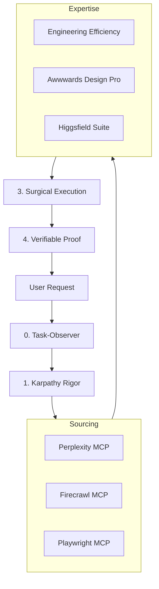

# 🏗 ARCHITECTURE.md - AIOS Technical Blueprint

## 🗺 System Topology
The AI Operating System is designed as a modular stack where the agent acts as the central orchestrator, routing requests through specific layers of intelligence.

## ⚙️ Layer Specifications

### 1. The Observation Layer (`task-observer`)
Acts as the "Meta-Cognition" of the system. It records habits, identifies skill gaps, and ensures the agent doesn't repeat mistakes across sessions.

### 2. The Sourcing Layer (Real-time Context)
Prevents the agent from relying on stale training data.
- **Perplexity**: Used for a "Quick Check" of facts and latest API versions.
- **Firecrawl**: Used for "Deep Dives" into documentation and competitor analysis.
- **Playwright**: Used for "Live Probing" of dynamic web applications.

### 3. The Expertise Layer (Domain Logic)
Injects professional standards into the output.
- **Engineering Efficiency**: Enforces a "Clean Code" mindset (O(n) complexity, SOLID principles).
- **Awwwards Design**: Enforces a "High-End" aesthetic (White space, Typographic rhythm).

### 4. The Validation Layer (Proof of Work)
Replaces "trust" with "evidence".
- **Playwright** is used to execute a headless browser check to confirm the feature works in a real environment.
- **OmniRoute** is used to cross-verify logic against other top-tier LLMs.
